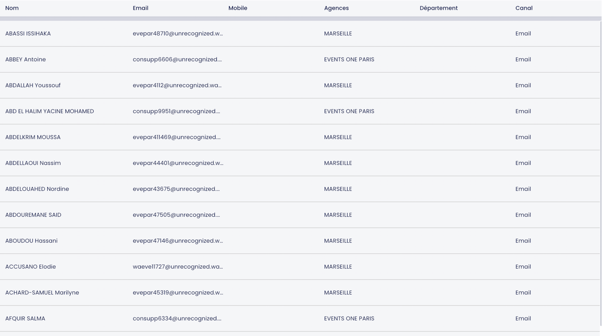

## Welcome, our dear candidate! 
    
### To be successful in resolving the test task please follow the next steps:
- If you are reading this Readme It means you have the access to the repo. Please clone it to local machine.
- Create your own feature branch where you will be able to commit your solution and create Pull Request at the final.
- The project contains the folder directory "estimations". Please create an empty text file inside.
- You will need the list of steps to implement the solution. 
Please describe the list of steps you will follow and provide a rough estimation.
 Clarify how many time you need to implement solutions on all steps separately.
- When the estimation will be ready, please commit the changes to git.
- During the implementation, please commit all steps from your estimation separately.
- The repository already has the initial platform to develop the Web application based on AngularJs framework and UI framework AngularJs. 
File package.json contains the script to develop and check the application locally. Please use it.
- The project has already implemented the default page. Please see the screenshot below.

  

- The main goal is to implement a UI solution to get the table with data and replace the default page.
Please see the screenshot below.

  

- You should use a technological stack which already exists in the project and in the example.
- The page contains should contain the custom scroll. Please develop SCSS mixin to be able to re-use these styles for whole application.
- The solution of the layout have to follow the principle of a responsive interface.
- The row in the table should be implemented as AngularJs directive and connected to the project.
- The email in the table is limited by 10 symbols. In case it has a length of more than 10 symbols it is sliced, and the three dots should appear at the end. 
The solution should be implemented as an AngularJs filter and connected to the project.
- The table renders the array of data. Let's implement AngularJs service which will grab the mock data from the file and have the method fetch to get the data.
- The method fetch of our service ought to return a promise. Please, simulate the delay in 3 seconds to get the fetched result.
- The rows in the table should be clickable. The Confirmation popup have to appear after user click any row.
- The Modal dialog contains the Contact's email and button with text "Navigate to final page".
- You as a User of the application can use this button to navigate the separated page.
- The "Final page" is similar to the default page from the screen №1 but has the URL "/fr/final"

### This is our final goal. We wish you the successful completion of the planned steps. Please, do not forget to push the solution to GitHub. 

